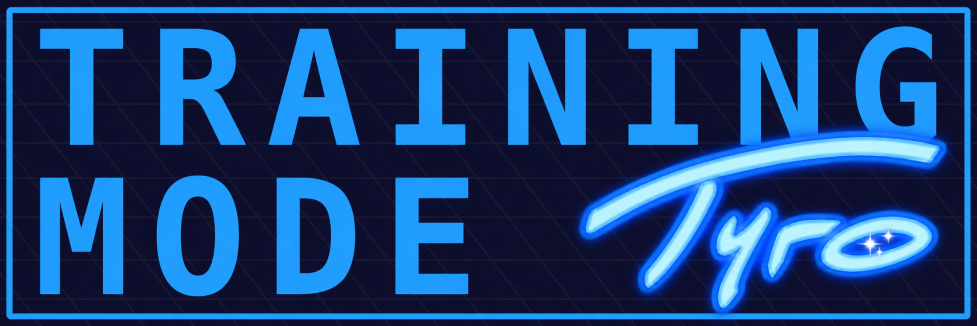



# Training Mode - Tyro Edition

Training Mode - Tyro Edition is an augmented version of Aitch's Training Mode - Community Edition, which is an extension of UnclePunch's training modpack for Super Smash Bros. Melee. It corrects what I feel are shortcomings to the program, making improvements based solely on my personal experiences as a frequent user and what I think would be useful for my own use. I have developed these features with the use of AI and have no plans to recreate any of my work without the use of AI, so for that reason they will not be eligible for merging into the Community Edition and should remain exclusive to this version of the program. Please do not use any work from this repository in part or whole as a contribution to Aitch's TM-CE.

I don't have my own community and I don't intend to spread this mod in a way to compete with community edition, I'm just going to continue making features that I think will be useful for myself.
So if you would like to access Aitch's original repo and discord you can go here. It is a great community and Aitch is an incredible dev:

To download the regular Community Edition ISO, click [here](https://github.com/AlexanderHarrison/TrainingMode-CommunityEdition/releases/latest).

Join the Community Edition [discord](https://discord.gg/2Khb8CVP7A) to discuss changes, new features, or ask for assistance.

## Development
Please read [DEVELOPMENT.md](DEVELOPMENT.md).

The Tyro version and stable game/save identity live in [version.h](version.h). Update `TM_VERSION` for a new release; keep `TM_GAME_ID` stable. Run `./build.sh --version` to see the version, game ID, and output filename.

## Tyro branch changelog

This section summarizes implemented Tyro-specific changes, newest version first. Keep one concise bullet per major feature within each version, updating that bullet for related adjustments. Changes to an earlier feature may receive a new bullet in a later version. Proposed changes stay in the relevant [OSD investigation](OSD-GLOBAL-SETTINGS-INVESTIGATION.md) or [Training Lab menu investigation](TRAINING-LAB-MENU-INVESTIGATION.md) until implemented.

### T3 (V1.4.1T3)

- Remember the selected event and page across sessions, restoring the cursor and scroll position on boot.
- Add numbered Fox/Falco Side-B Sweetspot distance guides that include drift, with a saved Enable Line Guides toggle defaulting to On.
- Extend the Invincibility Overlay to Marth and Roy's active grounded and aerial counter windows.
- Rework the Training Lab menu with eight category tabs, clearer option rows, descriptions and submenu previews, and apply/cancel value pickers; retain parent selections, shortcuts and existing saves.

### T2 (V1.4.1T2)

- Add saved Fixed Grid and Practice Panel OSD layouts with reserved feature positions, retained results and manual paging; Fixed Grid shows ten OSDs per page, while Practice Panel includes three previous timing results.
- Add saved OSD title colors and previews in both editors, plus separate CPU and all-OSD overrides in reorganized Global Settings menus.
- Simplify timing OSDs with compact frame counts, smaller arrows, colored hitlag/turnaround context and best-frame-relative colors; extend Act OoWait to landing and direct recovery exits.
- Replace Fox/Falco Act OoShine predictions with confirmed Jump Out Of Shine results, turnaround context and failure detection; give Jump Out Of Shine and JC Shine separate layout slots and histories, with corrected hitlag handling.
- Clarify Wavedash feedback with explicit hop types and duration-based colors, and add explicit L-cancel Success/Missed feedback.
- Fix corrupted, duplicated and overlapping OSD text by correcting native color encoding, row replacement and text sizing, with regression coverage.
- Add global Very Fast and Instant hitbox trails with player/team colors, translucent history, subfighter/projectile support and reliable cleanup across resets, restores and scene changes.
- Add a player-colored Invincibility Overlay for ledge, respawn, dodges, moves and Yoshi's double-jump armor, with reliable protection detection and rendering across respawns.
- Add Actionable Yellow>Green recovery cues and red Missed L Cancel / Run Turnaround diagnostics, with corrected detection and cue priority.
- Add full-health Infinite Shields for main fighters and subfighters.
- Expand Ledgedash with Attack/Dash goals, ledge selection, Protection Highlight, four success criteria and criterion-aware statistics; add configurable ground/platform egg targets and preserve reset behavior and randomized targets through regrabs.
- Save Ledgedash and Eggs-ercise event settings and add Reset Event Settings to both events; also correct Ledgedash's frame-advance button lookup.
- Remember human and CPU character choices across unrestricted events and saved sessions, using local fallbacks for events with required fighters.
- Consolidate saved settings into the existing 44-byte record, preserving scores, OSD choices and colors while saving every Lab overlay condition and migrating earlier Tyro settings.
- Fix memory-card crashes during settings saves and save creation by deferring saves to the initialized card service, guarding native save handling and correcting game-ID relocation.
- Centralize version metadata and give Tyro a separate disc/save identity, save caption, versioned release filenames, cross-platform patchers and matching banner/symbol-map names.
- Make partial builds rebuild modules after version/identity changes and stop ISO updates when a C module fails to compile.

### T1 (v1.4.1 T1)

- Add Eggs-ercise hitbox trails and Very Fast / Instant decay options in Eggs-ercise and Training Lab.
- Add Tyro Edition names, version labels and banners, with corrected in-game banner colors.
- Remove the restriction on AI-assisted contributions from the development guidelines.

## Changes From the Original
- New Training Lab Features:
    - Recording:
        - Reworked recording UI. Allows re-saveing existing recordings with different percents or positioning.
        - Savestates now require holding DPad right, preventing accidental savestates.
        - Set chances for slots during random playback.
        - Option to auto-restore state when the CPU performs a counter action.
        - Takeover HMN or CPU playback at any point.
        - Press DPad left/right when browsing savestates to quickly change pages.
        - Savestates can now always be saved. (May cause crashes if you save during special moves).
        - Option for the CPU to counter on hit or recording end during playback.
        - Play a recording slot as a counter action.
        - Resave Positions option will start the recording from a new position, without removing inputs.
        - Prune Positions option will start the recording from a new position, truncating inputs.
        - Re-Record mode will allow your to record over a previously recorded slot using playback takeover.
        - Start Paused option will only start the replay on your first input.
        - Add random additional percent when loading a state.
        - Slot Management menu - delete, copy, and edit slots.
    - CPU Options:
        - Random custom DI option. The CPU will pick a random option from your custom TDI.
        - CPU Shield angling options.
        - Added Wavedash counter actions.
        - Tech animations can be set invisible after they are distinguishable.
        - Added usmash OoS and all specials moves as counter actions.
        - All special moves can be used as counter actions.
        - Neutral jump action, set as the default.
        - SDI and ASDI options.
        - SDI is now set by number of inputs rather than by chance.
        - SDI and mashing are set to none by default.
        - Move CPU option.
        - Choose a port to control the CPU option.
        - CPU will use random TDI after custom TDI ends.
        - Option to reverse Custom TDI if on the other side of the player.
        - Tech lockout option. This prevents the CPU from teching in quick succession.
        - Tech trap option. This prevents the CPU from teching for a short window after being hit.
        - Added dash through and dash back counter actions.
        - Option to force shielded projectiles to always be powershielded.
    - Other Changes:
        - Alter set OSDs with the OSD menu in the lab.
        - Alter character RNG - choose misfire, nana throws, peach pulls and fsmash, and GnW hammer.
        - Added advanced counter actions - manually choose counter actions for each specific hit.
        - Added "Freeze CPU" option to freeze a CPU's hitboxes in place.
        - Set a chance to wait in miss tech.
        - Added shield health option.
        - Added new shortcut system, currently only supporting frame advance (Press Y then A in the menu).
        - Hitboxes are colored by ID and sorted by priority.
        - Game speed option.
        - Color overlays.
        - Lock percents.
        - Hazard toggle.
        - Hide stage model.
        - Item grab range display.
        - Show input and info displays for both HMN and CPU.
        - Mirror recordings.
        - The overlay, taunt, and input display options are saved to the memcard.
        - R can be used as a frame advance button.
        - Stage options to control stadium transformations and FOD platform heights.
        - Custom action state OSDs.
    - Import Menu Changes:
        - Fixed glitches when importing using a port other than port 1.
        - Fixed Sheik/Zelda transformations when loading.
        - Recordings are now filtered by the selected HMN character.
        - Cursor can now wrap.
        - Deleting replays too fast will no longer crash.
- Ledgedash Event Changes:
    - Colours have been updated to be colourblind friendly.
    - The airdodge angle is now consistent with other events.
    - Invincible grab hitboxes show like other hitboxes.
    - Added reset delay option.
    - Camera is now consistent across reset options.
    - HUD now updates and displays every frame.
    - Game speed option.
    - Swap sides on auto reset option.
    - Option to always maintain full ledge invincibility while on the ledge.
    - The GALINT frame is now correct if ledgedashing without refreshing.
    - Will no longer immediately reset on aerial.
    - Option to show current state as an overlay.
    - Sopo is used instead of both climbers.
- New Edgeguard Event:
    - Replaces Armada Shine event.
    - Learn the basics of edgeguarding Fox, Falco, Marth, Sheik, and Falcon!
    - Adjust the options the opponent uses to change the difficulty or practice specific situations.
    - Choose between preset values or manually adjust hit angle, knockback, and damage.
- OSD Changes:
    - Act OoWait OSD will trigger even with intermediate buffered actions such as a frame of walk.
    - Removed Max OSDs and Recommended OSDs options, replacing with a new OSD Position option.
    - Wavedash OSD now shows if it was a short hop or full hop.
    - Removed broken OSDs, rewriting the most important ones.
    - Added new glide toss, aerial out of double jump, special out of jump, and double jump out of jump OSDs.
    - Added new lockout timer OSDs.
    - Added new Fighter-Specific Tech OSDs with:
        - Spacies: Act OoShine and Shorten Frame.
        - Peach: Act OoFloat.
        - Yoshi: Egg Toss angle and strength.
- Bugfixes/Small Changes:
    - **Fixed cpu acting too late out of sakurai angle and other non-knockdown hits (such as fox drill).**
    - Updated to UCF 0.84 (Allows practicing with dashback out of crouch).
    - All trigger-based functionality can now be performed with analog-only triggers.
    - Nametags will now show up in C events.
    - Slow down advanced camera with R.
    - DIDraw will now show for sheik and after throws.
    - System inputs in info display will now work for ports other than port 1.
    - The lab now saves a minor savestate on boot.
    - Act OoHitstun now works after being hit by falco laser.
    - The powershield event has been rewritten and given a new laser height option.
    - Adjustable timing in Amsah tech event.
    - Jump actions no longer make the CPU self-destruct.
    - Various OSDs have been fixed.
    - Lightshield now works in recordings.
    - Added successful counters to the LCancel and Wavedash events.
    - Fix CPU DI on back throws and moves that send backwards.
    - Can now use lightshield L with DPad to adjust percents.
    - CPUs now DI DK cargo throw.
    - Samus homing missiles will target the CPU.
    - Nana will not drop shield when Popo's shield is hit.
    - Added the polling drift fix.
    - Deleting replays too fast will no longer crash.
    - Every character can be used in Amsah Tech training.
    - Removed the maximum distance in Reversal training.
    - Added getup attacks and dash attack to Reversal training.
    - Added option to move to the platform in Reversal training.
    - Infinite shields now applies to nana.
- Work in progress:
    - Reaction Tech Chase Event
    - Improving the savestate format
- Developer Features:
    - Simple and easily reproducible builds on Windows and Linux.
    - Simple to add new events - no need to touch ASM.
    - Fast recompilation on Linux using make.
    - Simplified and performant [tool](https://github.com/AlexanderHarrison/gc_fst) to extract and rebuild ISOs.
